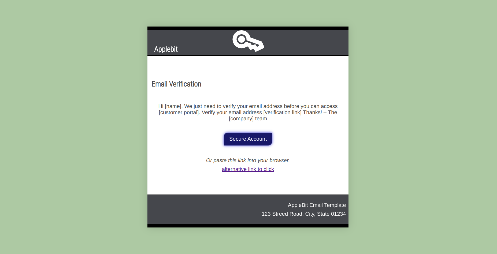
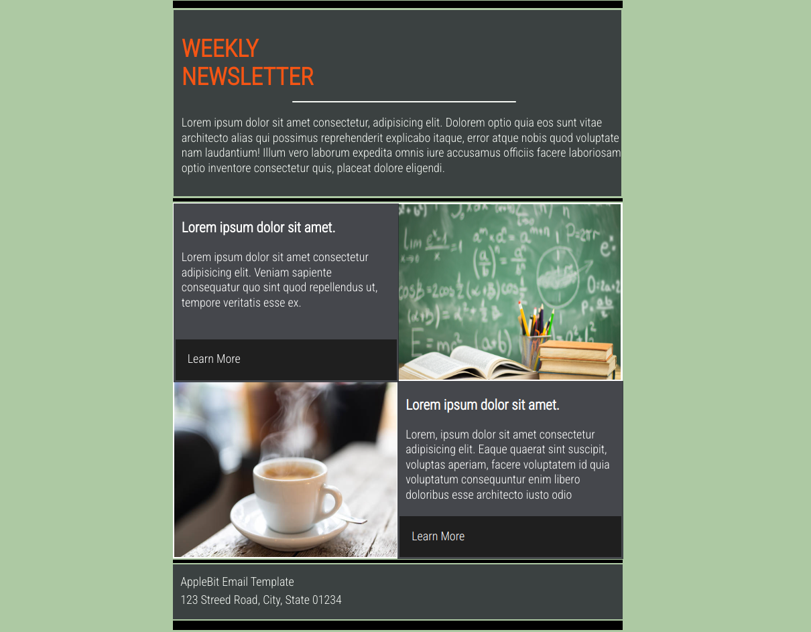

<h1>Email templates</h1>

  <h3>Email Verification</h3>
  
  <a style="font-size:16px;margin-top:12px;text-decoration:none;" href="https://github.com/KylesTech95/crm-email-temp/tree/email-verification">Link to Branch</a>

  

  <h3>Newsletter</h3>
  
  <a style="font-size:16px;margin-top:12px;text-decoration:none;" href="https://github.com/KylesTech95/crm-email-temp/tree/newsletter">Link to Branch</a>

  

